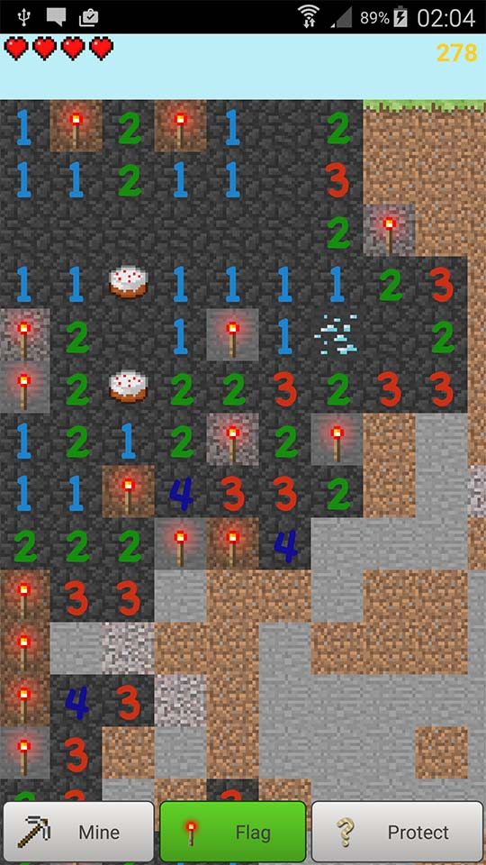
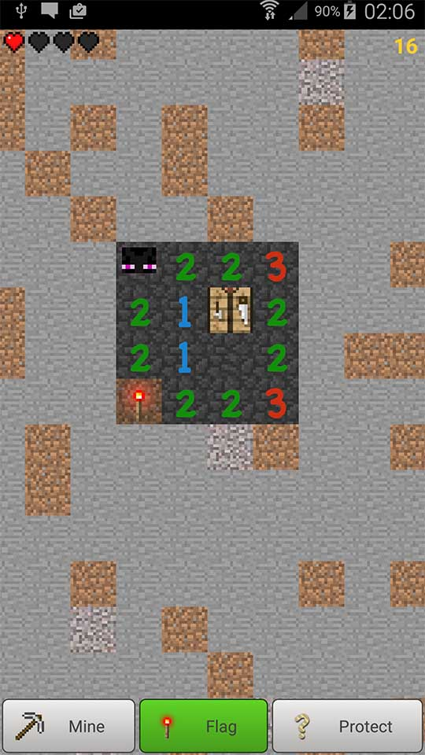
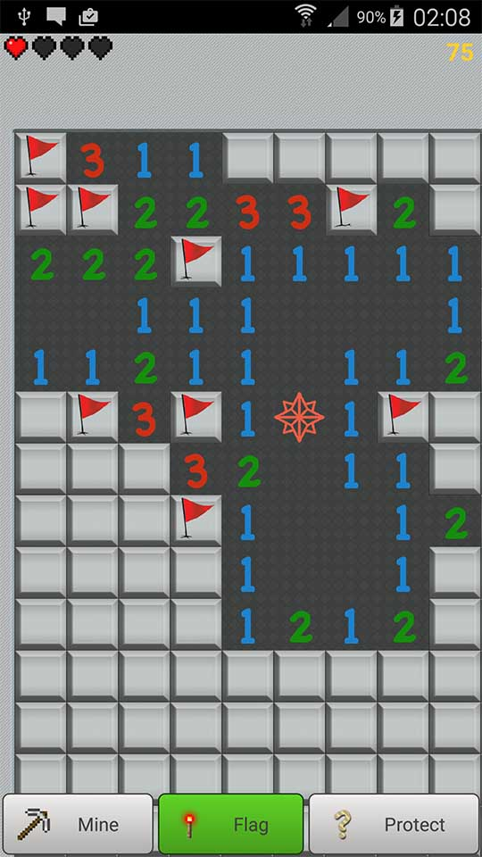

Puzzle game based on minesweeper game with a new twist. We also have MineCraft theme since we love the original game!

**Disclaimer**: This game is developed independently from Microsoft and Mojang. This game is also not related to [the Minecraft game](https://play.google.com/store/apps/details?id=com.mojang.minecraftpe&hl=en_GB) apart from similar theme.

The game include three game modes:

 - **Classic** for the lovers of original minesweeper game.
 - **Adventure** explore very large map where we hidden treasures through the map. You have four lives and can replenish them by discovering food. Your goal is to open all the hidden tiles, but it will not be easy.
 - **Rescue** you have to save your friend lost somewhere in the map before the time runs out. Hurry!

Other features:

 - Highsores via Google Play - compete wit your friends
 - Pinch to zoom
 - Multiple themes 
 - Frustration free  

    

    

    

# Getting the game

You can install game from Google Play Store

<ul class="actions">
	<li><a href="https://play.google.com/store/apps/details?id=com.misiunas.mcs
" class="button special icon fa-android">Install via Play Store</a></li>
</ul>

However, after legal issue with Microsoft that went unresolved the game is not available on European Play store. Instead, you can install it directly via APK file. Download the game below and you can follow these [instructions](http://www.ubergizmo.com/how-to/how-to-install-apk-files-sideloading-on-android/) on  installing the APK files

<ul class="actions">
  <li><a href="https://dl.dropboxusercontent.com/u/12073958/MC-Sweeper-release.apk" class="button special icon fa-download">Download .APK file</a></li>
</ul>

# Contribute

Want to help? Awesome! Contributions make this game great!

### Give feedback

<ul class="actions">
    <li><a href="mailto:support+mcs@misiunas.com" class="button icon fa-email">Email me</a></li>
    <li><a href="https://github.com/kmisiunas/minecraft-sweeper/issues" class="button icon fa-github">via GitHub</a></li>
</ul>

### Translate to your language

Would you like to see the game in your language? I would like that too! Help me translate this game to your language. [I wrote brief instructions on how to do this](https://github.com/kmisiunas/minecraft-sweeper). 

### Spread the word

Let others know that you like this game by sharing a link 

`http://minecraft-sweeper.com`

or direct link to the Play Store

`http://goo.gl/MRh1M`

<!-- todo: what are popular social media channels across the world -->

<ul class="actions">
    <li><a href="https://twitter.com/home?status=Try%20this%20awesome%20puzzle%20game%20for%20Android%3A%20www.minecraft-sweeper.com" class="button icon fa-twitter">Tweet</a></li>
    <li><a href="https://www.facebook.com/sharer/sharer.php?u=http%3A//minecraft-sweeper.com" class="button icon fa-facebook">Facebook</a></li>
    <li><a href="https://plus.google.com/share?url=minecraft-sweeper.com" class="button icon fa-google-plus">Google+</a></li>
</ul>

# Publicity

 - [Kotaku magazine article](http://kotaku.com/5878388/when-minesweeper-met-minecraft-a-gaming-app-love-story)

# Authors

My name is **Karolis Misiunas** and I created the initial game after getting my first Android phone. It was a fun project that helped me learn to code. Since then the game had contributions from other people and I would like to acknowledge them:

 - **Tautvydas Misiunas** developed the highscore system for v2 and continuously advised on technical aspects. Thanks, bro!
 - **JelleWho** made countless suggestions for the v3. The game looks much better because of you!
